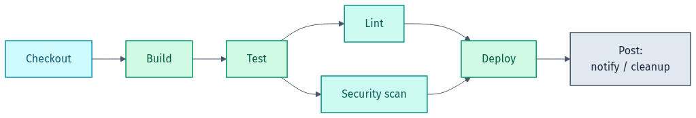
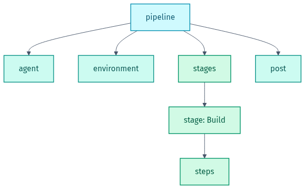
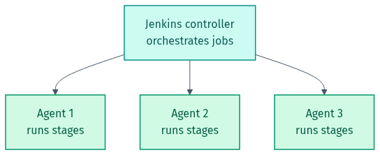

# 🖼️ Diagram Gallery — Groovy & Jenkins

Rendered diagrams for this lab in **light + dark**. They adapt to your GitHub theme below; grab the files directly for slides or LinkedIn.

- Light: `NN-name.png` / `.svg` · Dark: `NN-name-dark.png` / `.svg`
- Editable Mermaid source lives in [`src/`](src). Re-render from the repo root with `render-diagrams.ps1`.

## 🎨 Colour legend
| Colour | Means |
|--------|-------|
| 🔵 Cyan | trigger / start |
| 🟢 Teal / Green | stages & blocks |
| 🟠 Amber | — |
| ⚪ Slate | post / notify |

---

### Jenkins pipeline stages (with parallel)
Checkout → Build → Test → (Lint + Security in parallel) → Deploy → Post.

<picture><source media="(prefers-color-scheme: dark)" srcset="01-pipeline-stages-dark.png"></picture>

### Declarative pipeline structure
<picture><source media="(prefers-color-scheme: dark)" srcset="02-declarative-structure-dark.png"></picture>

### Controller and agents
<picture><source media="(prefers-color-scheme: dark)" srcset="03-jenkins-agents-dark.png"></picture>

---

Made by **Shubham Sharma** · [GitHub](https://github.com/shubhs248) · [LinkedIn](https://www.linkedin.com/in/shubhs248)
